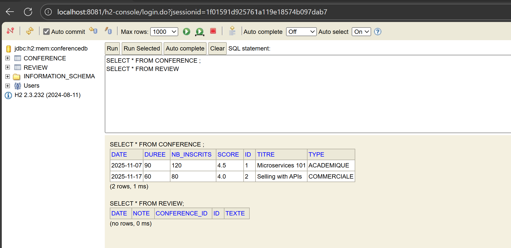
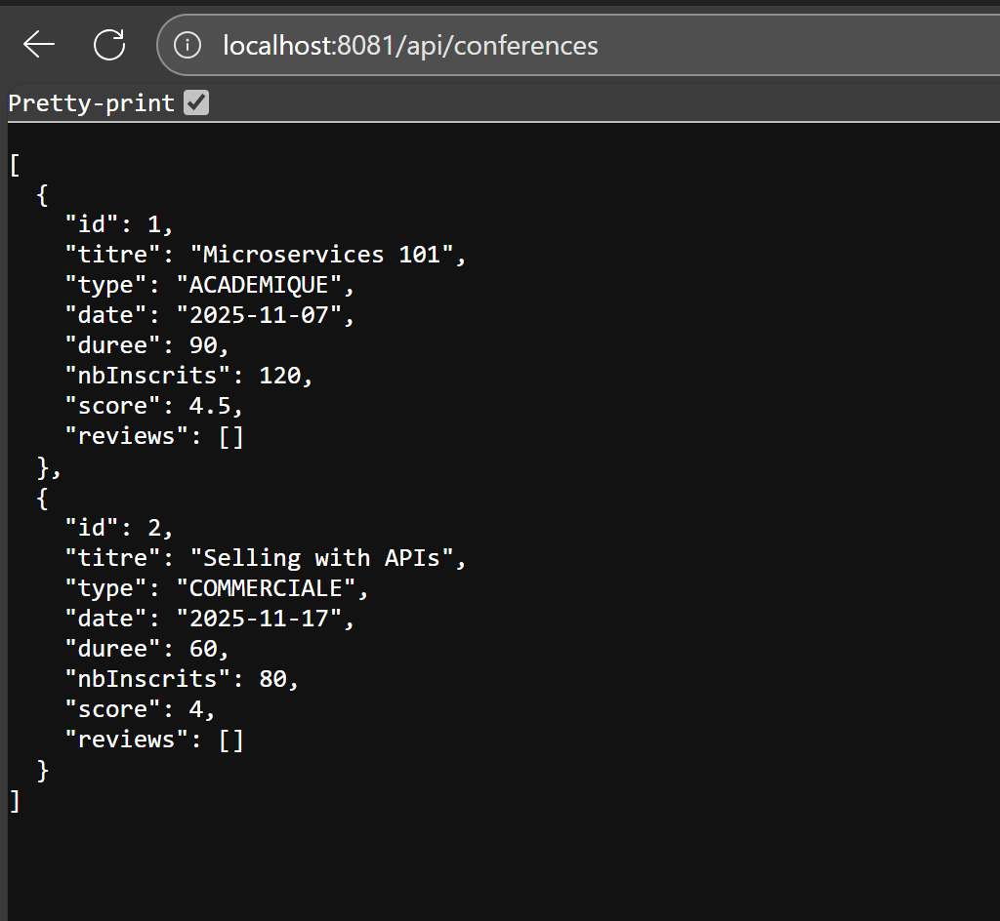
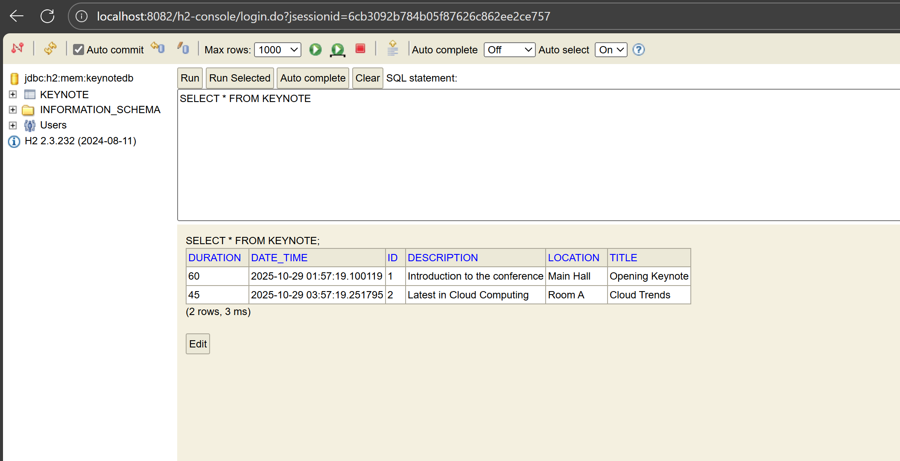
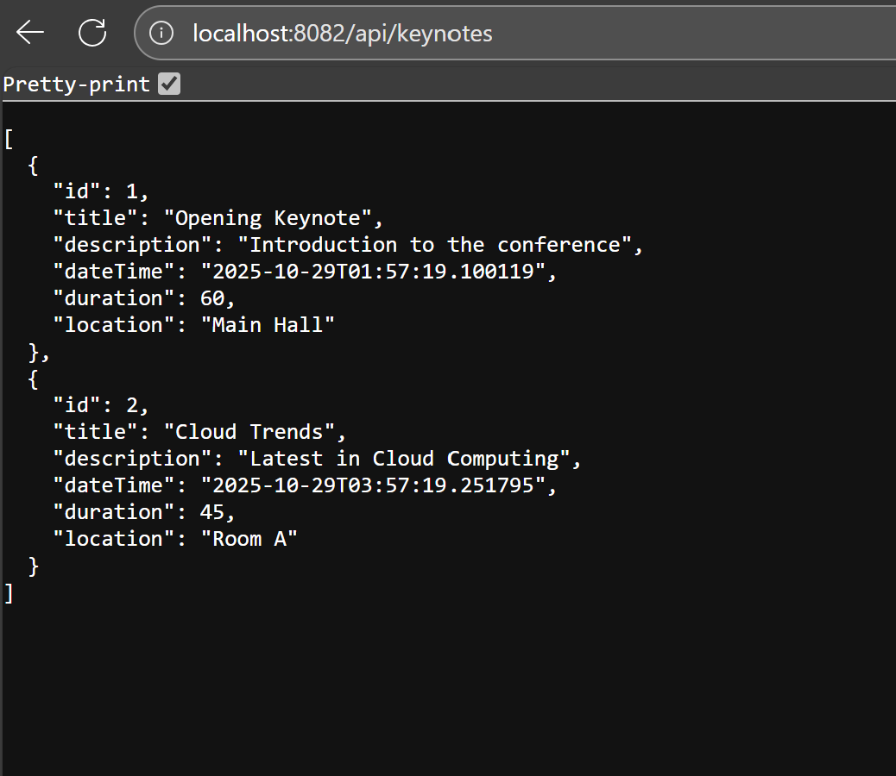
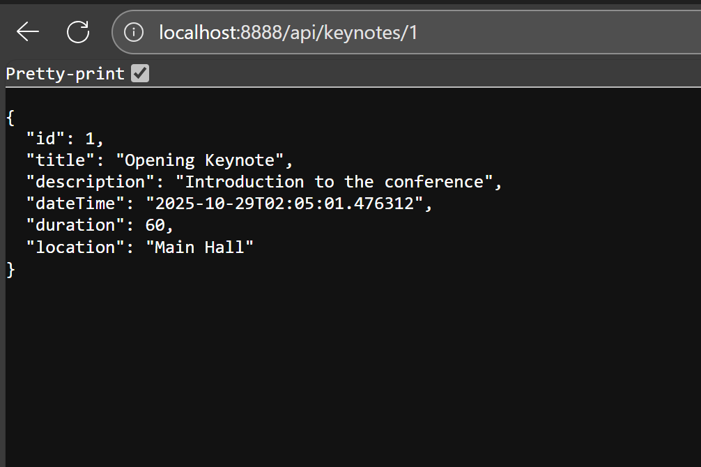
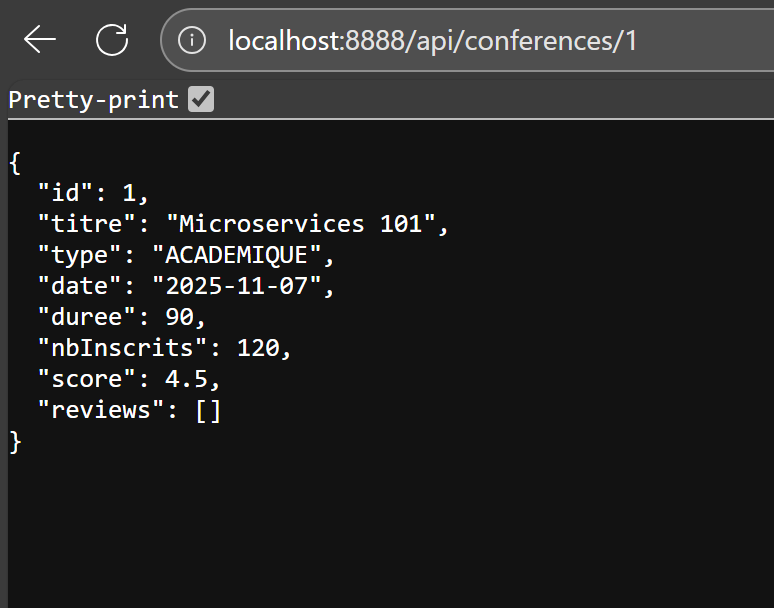
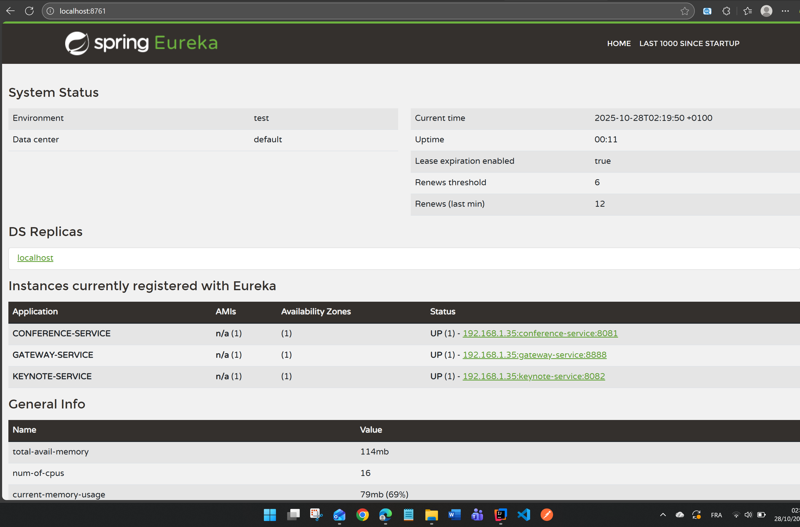
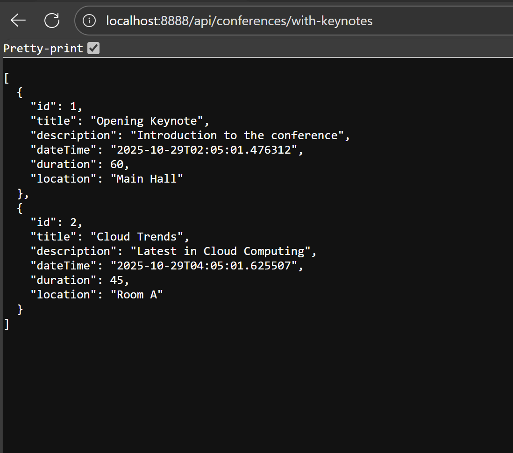
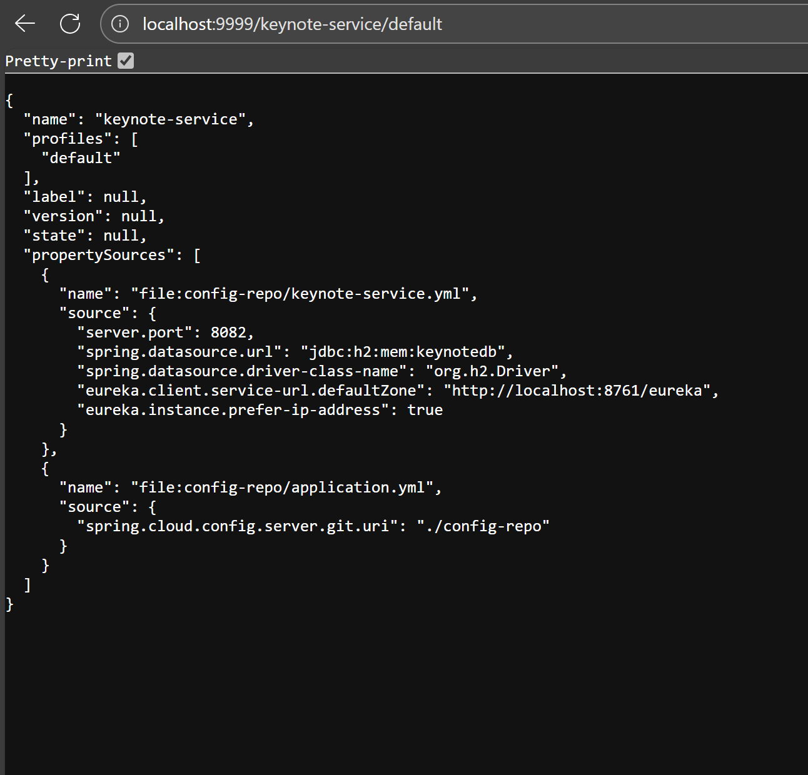
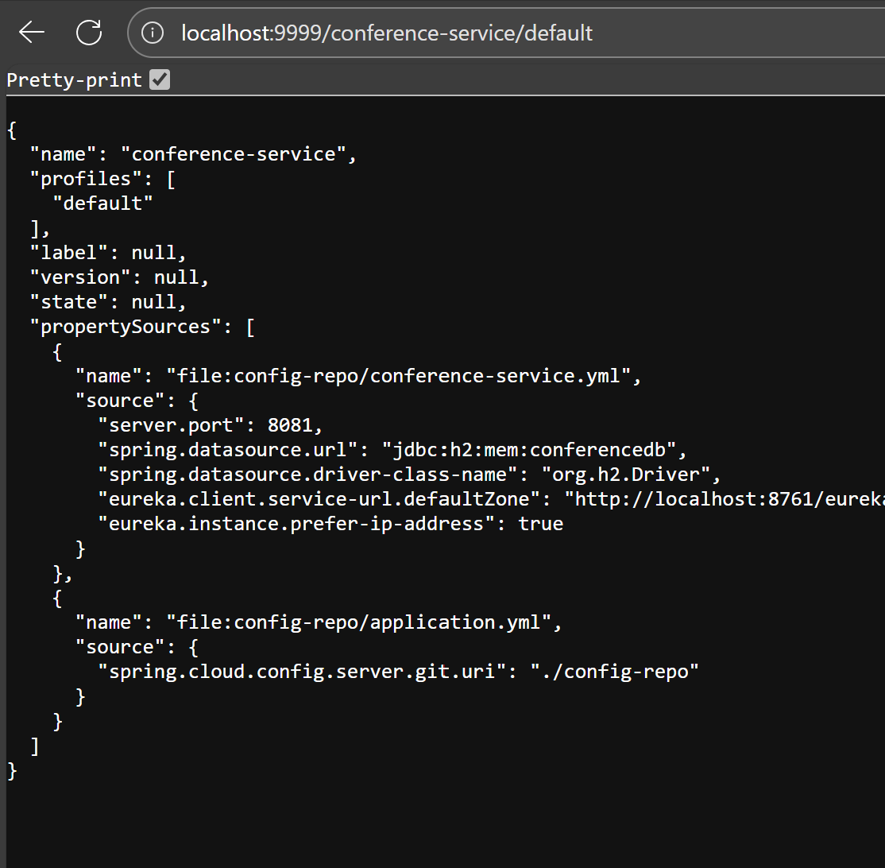

# Architecture Technique du Projet – Gestion de Conférences

## 1. Vue globale

L'application est basée sur une **architecture micro-services** avec les composants suivants :  

Angular Frontend
|
v
Gateway Service (Spring Cloud Gateway)
|
+----------------+
|                |
Discovery Service    Config Service
(Eureka Server)      (Spring Cloud Config)
|
+----------------------------+
|                            |
Keynote Service                  Conference Service
(REST API, Swagger, Resilience4J)  (REST API, Reviews, Feign Client)
|
Database (H2/PostgreSQL)

## Test conference-service 

## Test keynote-service

## Test discovery-service + gateway-service

## Test Feign coté conference

## Test de config-server

